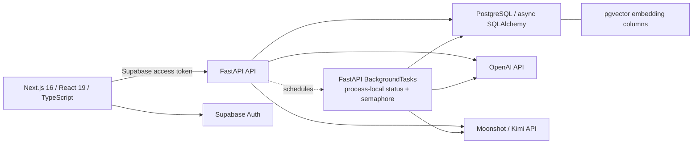

# College AI

College AI is a full-stack study workspace that turns class material into structured concepts, practice, feedback, and exam-preparation plans. I built it to explore a practical question: how can an AI-assisted product preserve source context and useful learning state instead of acting like a stateless chatbot?

> **Status:** Archived/discontinued portfolio project. The repository contains a functional MVP and is being prepared as proof of engineering work; it is not operated as a production service or under active commercial development.

## What it demonstrates

- Course-scoped notes, uploads, concepts, flashcards, practice, tutoring, analytics, and destructive data controls.
- Supabase session handling with backend bearer-token validation and user/class ownership checks.
- Async FastAPI and SQLAlchemy data flows across a substantial PostgreSQL model.
- OpenAI and Moonshot/Kimi integrations; selected structured-output paths include repair and validation.
- Embedding storage in 1,536-dimensional `pgvector` columns. Retrieval currently loads the class's concepts and computes cosine similarity in application code with NumPy; it does not use a database KNN query.
- A mounted Exam Prep/Exam Lockdown workflow that stores extracted source questions, ranks recommendations, creates a schedule, and coaches against the selected source-linked question.
- Process-local background concept extraction with persisted progress/failure state.

## Product flow

1. Create a course and add notes or supported files.
2. Extract concepts and flashcards from the material.
3. Generate practice for weak concepts and record attempts, confidence, mistakes, and mastery.
4. Use tutoring, work review, analytics, and knowledge-map views to inspect gaps.
5. Upload a syllabus and exam materials, then create an evidence-based Exam Prep plan and enter Exam Lockdown coaching.

The Planner page exposes the Exam Prep planner. Older daily and weekly planning endpoints and React components remain in the repository for inspection, but they are not mounted in the current Planner UI.

## Architecture



The browser sends a Supabase bearer token to FastAPI. The API verifies that token with Supabase and scopes database queries to the resulting user ID. Notes, generated artifacts, attempts, mastery, plans, and source references are persisted in PostgreSQL. Some draft study state—such as blurting/mind-map boards and homework chat display history—is stored in browser `localStorage` instead.

See [Architecture](docs/ARCHITECTURE.md) for the main data paths and trust boundaries.

## Interesting engineering problems

- **Deterministic boundaries around model output.** Selected structured-response paths normalize, repair, schema-check, and convert provider output into persistent domain records before downstream use; conversational paths can still return model text directly.
- **Grounded exam coaching.** Uploaded material is converted into persisted questions with source metadata. Recommendations point to those records, so the lockdown tutor can load the exact planned question rather than inventing an unrelated one.
- **Staged extraction without queue infrastructure.** Long concept extraction runs after the request, is limited by a process-local semaphore, and records progress and terminal state in the note row. A restart marks interrupted work idle instead of pretending it completed.
- **Interconnected learning state.** Attempts feed mistake logs, tutor memory, mastery history, review dates, remedial practice, readiness, and analytics.
- **User isolation across related records.** High-value reads, writes, and class deletion flows carry the authenticated user and class boundaries through multi-table operations.
- **Honest retrieval tradeoff.** PostgreSQL stores pgvector-compatible embeddings, while the MVP performs small per-class cosine ranking in Python. That is simple to inspect, but it is not the approach for a large corpus.

## Stack

| Layer | Technologies |
| --- | --- |
| Frontend | TypeScript 5, Next.js 16, React 19.2, Tailwind CSS 3.4, TanStack Query 5, Zustand 5 |
| Backend | Python, FastAPI, Pydantic, async SQLAlchemy 2, asyncpg |
| Data | PostgreSQL, JSONB, pgvector columns |
| AI and documents | OpenAI SDK, Moonshot/Kimi-compatible API, NumPy, PyMuPDF, Pillow, python-pptx, JSON repair/schema validation |
| Identity | Supabase Auth |
| Quality | pytest, ESLint, TypeScript, GitHub Actions |

## Local setup

Use Python 3.12 and Node.js 22 to match CI.

```bash
git clone <your-fork-or-local-copy>

cd study-app/backend
python -m venv .venv
source .venv/bin/activate
pip install -r requirements-dev.txt
cp .env.example .env
# Edit .env with your own database, Supabase, and AI-provider values.
uvicorn app.main:app --reload
```

In another terminal:

```bash
cd study-app/frontend
npm ci
cp .env.example .env.local
# Edit .env.local with your own public Supabase values.
npm run dev
```

Open `http://localhost:3000`; the API health check is `http://localhost:8000/health`.

Important setup caveat: this repository contains only the three incremental Exam Prep/Lockdown SQL migrations, not a complete base-schema migration. It cannot bootstrap a blank database from repository files alone. You need a compatible existing schema or an owner-supplied baseline before applying the migrations in `backend/migrations/`. See [Setup](docs/SETUP.md) for environment variables, development auth, upload limits, and database details.

## Tests and validation

The automated tests are deliberately provider-free and focus on deterministic security and learning logic.

```bash
cd backend
python -m compileall -q app
pytest -q

cd ../frontend
npm ci
npm run lint
npm run typecheck
npm run build
```

`.github/workflows/ci.yml` runs these backend and frontend checks on pushes and pull requests. It does not deploy, call AI providers, authenticate against Supabase, or run database integration tests.

## Privacy and security notes

This code handles uploaded course material, answers, chat context, and derived learning data. Depending on the feature, content can be sent to the configured OpenAI or Moonshot/Kimi account. Do not use real student records or confidential course material unless you have evaluated those providers and your own obligations.

The MVP includes bearer-token validation, explicit CORS origins, user/class scoping, bounded uploads, extension allowlists, safe filename handling, and server-side grading for multiple-choice attempts. It also has important limits:

- No repository-proven rate limiting, malware scanner, formal retention policy, penetration test, production RLS policy, or compliance program.
- `localStorage` content is readable by scripts running on the same origin and is not covered by server-side class deletion. Sign-out clears known app-owned study-state keys in the current browser, not data on other profiles or devices.
- Class clear/delete endpoints remove the application's known server-side class records, but there is no account-level erasure workflow or independently verified retention guarantee.
- Background extraction is process-local and non-durable. It has no Redis, external worker, retry queue, or multi-instance coordination.
- Some provider calls are isolated from the event loop, but the codebase is not a fully audited non-blocking system.

Read [Privacy and security](docs/PRIVACY_AND_SECURITY.md) before running the app with real data.

## Known limitations

- Archived portfolio MVP; no deployment configuration or production environment is included.
- Fresh database setup is incomplete because the base migration is absent.
- AI quality has no formal benchmark, and generated output can be incomplete or wrong.
- Open-response correctness is self-assessed; time spent is recorded but does not affect the current mastery formula.
- Readiness averages stored mastery values and does not apply forgetting decay at read time.
- Daily/weekly planner code is not mounted in the current UI; Exam Prep/Lockdown is the live planning path.
- Application-side vector ranking and process-local jobs are suitable only for the MVP's small scope.

## Documentation

- [Project overview](docs/PROJECT_OVERVIEW.md)
- [Architecture](docs/ARCHITECTURE.md)
- [Setup](docs/SETUP.md)
- [Features and status](docs/FEATURES.md)
- [Development guide](docs/DEVELOPMENT_GUIDE.md)
- [Privacy and security](docs/PRIVACY_AND_SECURITY.md)
- [Troubleshooting](docs/TROUBLESHOOTING.md)
- [Mastery implementation note](backend/mastery_system.md)
- [Planning implementation note](backend/study_plan_system.md)
- [Learning loop](backend/learning_loop.md)

