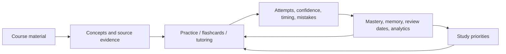

# Learning loop

College AI's core design is a persisted feedback loop around AI-assisted content:



It is an MVP heuristic loop, not a claim of validated personalization.

## 1. Capture and structure

Users create a course, write notes, or upload a supported document. The API extracts text, stores a note, and schedules process-local concept extraction. The background job can refine text, derive structured concepts, classify relationships, create embeddings, link concepts to the note, and generate/ground flashcards.

The note row persists extraction status and progress. Live status is also cached in memory; a restart interrupts work and resets stale queued/running notes rather than resuming them.

## 2. Generate learning activities

Practice generation reads the course's concepts and mastery values, favors weaker concepts, and persists a practice set and questions. Other surfaces reuse the same knowledge state for flashcards, hints, tutoring, homework coaching, analytics, and graph views.

Provider output is probabilistic. Selected structured paths constrain it with prompts, JSON repair, schemas, bounded inputs, persisted IDs, and failure states; conversational paths may return model text directly.

## 3. Record evidence

Practice attempts store:

- answer JSON;
- server-derived MCQ correctness or self-assessed open correctness;
- confidence and time spent;
- question, concept, and optional exam-session links;
- timestamp.

Incorrect work can add mistake logs and tutor memory. Homework work review and Lockdown have their own persisted review/attempt/pitfall records.

## 4. Update learning state

A practice attempt applies forgetting since the previous practice, then a Bayesian-style mastery update. It writes history, timestamps, and the next review date. Repeated failures can create a remedial set. Flashcard ratings and detected homework misconceptions also modify mastery using separate heuristics.

See [mastery_system.md](mastery_system.md) for the exact behavior and inconsistencies.

## 5. Surface priorities

Readiness, weak-concept lists, mistake/tag analytics, and the knowledge graph expose stored learning signals. The generic daily/weekly planner can compute non-persisted schedules from mastery/review state, but its UI is currently unmounted.

The live Planner path is Exam Prep:

```text
syllabus + uploaded exam material
    → parsed evidence + persisted source questions
    → topic scores + recommended source-question links
    → persisted days/tasks
    → Exam Lockdown coaching and progress
```

This branch is more evidence-oriented than the generic planner. It can still be wrong: extraction, topic likelihood, difficulty, and coaching depend partly on model output.

## 6. Repeat

The user returns to practice, flashcards, tutoring, or Lockdown. New evidence updates the relevant state, and subsequent screens read the updated records. There is no autonomous scheduler that continuously trains a student model in the background.

## Persistence boundaries

- PostgreSQL is the system of record for server-side course and learning data.
- Concept embeddings are stored in pgvector columns, while per-course cosine ranking is performed with NumPy in the application.
- Blurting/mind-map boards and some UI/chat/session state live in browser `localStorage` and do not participate reliably in the server loop.
- AI providers receive selected raw or derived context; provider retention and controls are external to this repository.

## Interpretation limits

- Mastery/readiness are product heuristics, not grades or psychometric scores.
- Open-response correctness is self-assessed.
- Time spent is recorded but does not currently change mastery.
- Stored readiness does not decay merely because time passes.
- Exam topic predictions and recommendations are estimates, not guarantees.
- No formal learning-outcome or AI-quality benchmark is included.
- Process-local background work, application-side retrieval, and incomplete base migrations limit production suitability.
