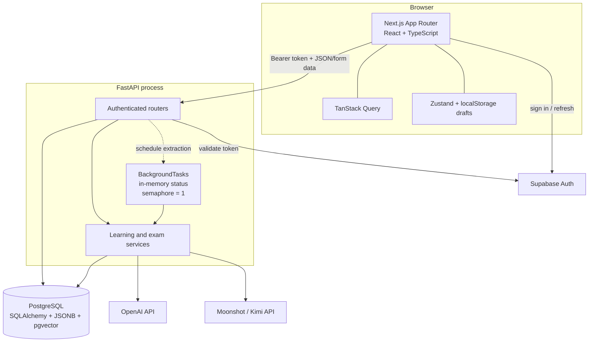
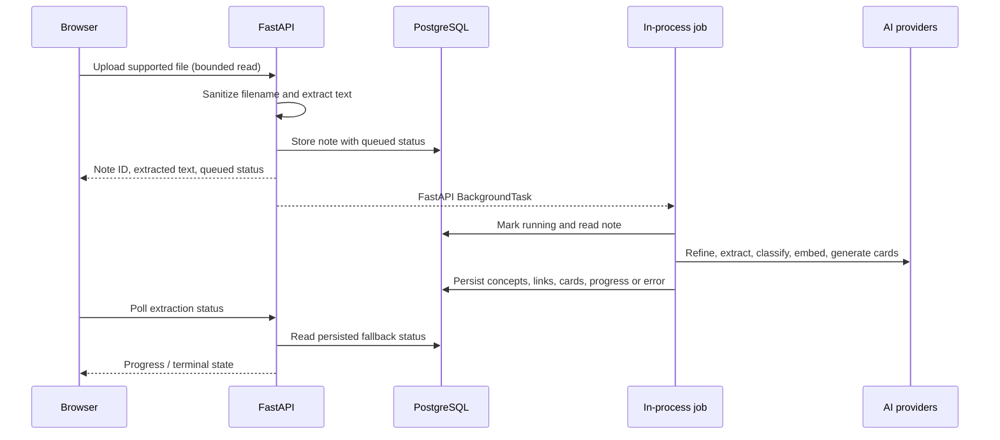
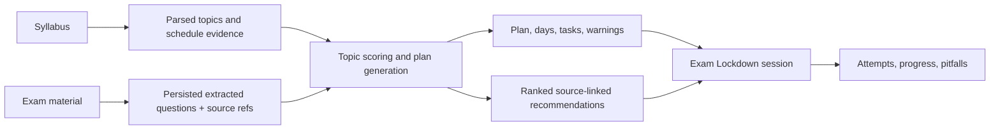

# Architecture

College AI is a browser client, an authenticated REST API, PostgreSQL, and two external AI-provider boundaries. It is a modular monolith rather than a distributed system.

## Frontend

The Next.js 16 App Router application is client-heavy. Pages compose feature components, TanStack Query handles API-backed server state, and Zustand holds selected-course/application state. The API client in `frontend/lib/api.ts` attaches the current Supabase access token.

The browser also persists several drafts with `localStorage`:

- blurting and mind-map boards, keyed by course;
- homework chat display history, keyed by course;
- flashcard/session UI state;
- extraction polling metadata and the current practice index.

That content is separate from PostgreSQL. It is neither encrypted nor automatically covered by server-side class deletion.

The current Planner route mounts `ExamPrepPlannerPanel`. The earlier daily and weekly planner components are present but unmounted.

## Authentication and authorization

1. The browser obtains a Supabase session.
2. API calls send `Authorization: Bearer <access-token>`.
3. `backend/app/services/auth.py` calls Supabase's `/auth/v1/user` endpoint with that token and the configured anonymous client key.
4. The resulting UUID is injected into routes as `user_id`.
5. Queries constrain user-owned records with that ID and, for nested flows, the selected class ID.

`DEV_MODE=true` bypasses token verification only when `APP_ENV` is explicitly `development` or `test`; the application refuses to start with the bypass in another environment. This mode represents a fixed development UUID and must never be used on a shared or public service.

Authorization is primarily application-layer. The repository does not provide or prove production PostgreSQL row-level-security policies.

## Data access

FastAPI dependencies create async SQLAlchemy sessions backed by `asyncpg`. The engine uses `NullPool`, pre-pings connections, and sets a database statement timeout. Domain rows use PostgreSQL UUIDs, JSONB, ordinary indexed columns, and a `Vector(1536)` field for concept embeddings.

The repository has model declarations for the full domain but not a complete migration history. The three SQL files under `backend/migrations/` are incremental Exam Prep/Lockdown changes; there is no baseline migration or startup `create_all` path.

## Note ingestion and background extraction

The process maintains a small live-status dictionary and permits one heavy concept extraction at a time. The note row is the durable source for terminal state. On API startup, previously queued/running notes are reset to idle with an interruption message. There is no durable queue, cross-process lock, automatic retry policy, or Redis dependency.

Chunk-level model calls may use a separate bounded concurrency setting. That does not turn the job runner into a distributed worker system.

## Embeddings and retrieval

Concept embeddings use OpenAI `text-embedding-3-small` and are stored in the pgvector-compatible column. For a query, the service:

1. embeds the query;
2. loads concepts for the selected user/course;
3. generates a missing concept embedding when required;
4. converts vectors to NumPy arrays;
5. computes cosine similarity in Python and sorts the small candidate set.

The database is therefore embedding storage, not the nearest-neighbor execution engine. A larger deployment would normally move ranking to indexed database queries or a dedicated retrieval service.

## Practice and mastery flow

Practice generation starts with course concepts and stored mastery, favors weaker concepts, and writes a `PracticeSet` plus `Question` rows. Attempt submission verifies question/session ownership, recomputes MCQ correctness from the stored answer index, and otherwise accepts a self-assessment.

An attempt can update:

- the attempt record and timing/confidence;
- mistake logs and tutor memory;
- the concept's mastery and mastery history;
- its next-review timestamp;
- cross-concept weakness output;
- an automatically generated remedial set after repeated failures.

Forgetting is applied when an attempt updates mastery, not continuously. The readiness endpoint averages currently stored mastery values. The exact formula is documented in [`backend/mastery_system.md`](../backend/mastery_system.md).

## Exam Prep and Exam Lockdown

Exam Prep is the mounted planning architecture:

Models help parse evidence and coach the user. Persistence and deterministic service logic establish record ownership, active status, scoring inputs, schedules, recommendation links, progress, and failure responses. “Likely topic” and confidence values are estimates, not guarantees about an exam.

## Provider boundaries

Both provider keys can be needed for the complete feature set:

- OpenAI handles embeddings, vision-assisted extraction, and several practice, exam, planning, and lockdown operations.
- The Moonshot-compatible client uses Kimi models for note processing and several homework/performance operations.

Requests can contain raw or derived course material, questions, answers, mistakes, and chat context. Provider terms and data controls are outside this repository.

## Reliability and scale boundaries

- CORS uses explicit configured origins and disallows `*` with credentialed requests.
- Uploads are read with a byte limit and route-specific extension allowlists; document expansion, page count, and pixel count also have bounds.
- Several provider calls are moved to a thread pool so they do not directly block the event loop, but the entire codebase has not been proven non-blocking.
- There is no rate limiter, malware scanner, distributed queue, production observability stack, formal backup policy, or deployment topology here.
- Tests target deterministic logic without live providers or a live database. They are not an integration, security, or AI-quality test suite.

See [Privacy and security](PRIVACY_AND_SECURITY.md) for the public-use threat model and [Setup](SETUP.md) for configuration.
