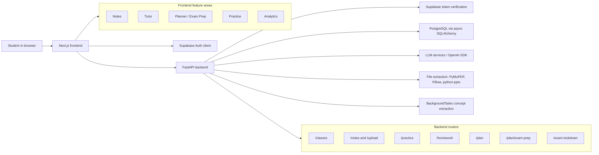
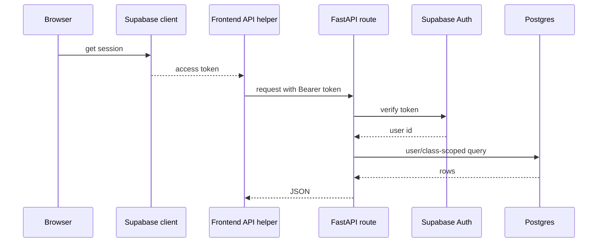
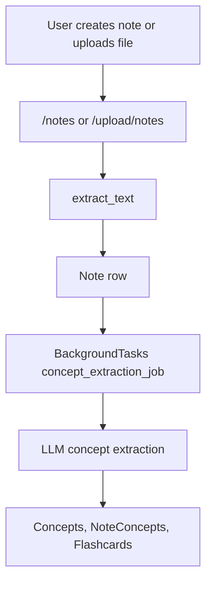
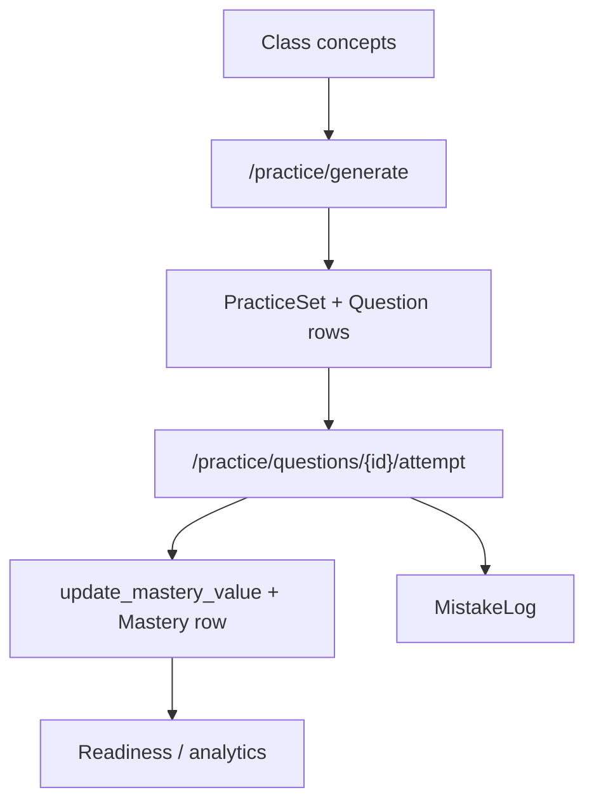
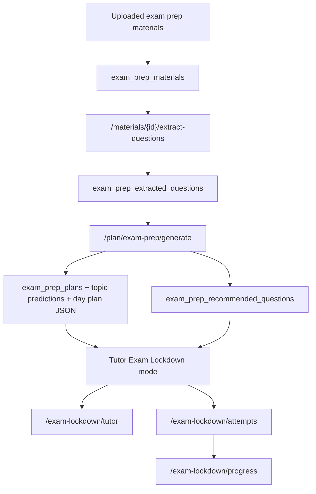

# Architecture

## High-Level Architecture

College AI is a two-app web system:

- `frontend/`: Next.js client application.
- `backend/`: FastAPI API server.

Persistence is modeled with SQLAlchemy ORM classes in `backend/app/models.py` and backed by PostgreSQL through async SQLAlchemy. Authentication uses Supabase sessions on the frontend and backend token verification through Supabase Auth.

## Entry Points

| Layer | Entry point | Notes |
| --- | --- | --- |
| Frontend app | `frontend/app/layout.tsx` | App shell and global layout. |
| Frontend home | `frontend/app/page.tsx` | Root page. |
| Frontend routes | `frontend/app/*/page.tsx` | Next.js app routes for product pages. |
| Frontend API client | `frontend/lib/api.ts` | Typed API wrapper used by components. |
| Frontend auth | `frontend/lib/auth.ts`, `frontend/lib/supabaseClient.ts` | Session and authenticated fetch helpers. |
| Backend app | `backend/app/main.py` | Creates FastAPI app, configures CORS, registers routers. |
| Backend DB | `backend/app/db.py` | Async engine, sessionmaker, dependency. |
| Backend models | `backend/app/models.py` | SQLAlchemy ORM models. |

## Major Backend Modules

| Module | Responsibility |
| --- | --- |
| `backend/app/routers/classes.py` | Class CRUD and clearing class-scoped data. |
| `backend/app/routers/notes.py` | Manual note creation, listing, retrieval, extraction job start/status. |
| `backend/app/routers/uploads.py` | Note file upload and text extraction before queued concept extraction. |
| `backend/app/routers/concepts.py` | Concept extraction endpoint, concept listing, flashcard routes. |
| `backend/app/routers/practice.py` | Practice generation, attempts, exam sessions, hints, step checks, analytics, dependencies, flashcards due/grade. |
| `backend/app/routers/homework.py` | Homework help, homework upload help, chat history, work review, step review, pitfalls. |
| `backend/app/routers/plan.py` | Daily and weekly plan generation. |
| `backend/app/routers/exam_prep.py` | Syllabus/material upload, material question extraction, exam prep plan generation, plan detail, tasks. |
| `backend/app/routers/exam_lockdown.py` | Exam Lockdown sessions, progress, tutor response, attempts, pitfalls. |
| `backend/app/routers/performance.py` | Exam performance analysis and insights. |
| `backend/app/services/llm.py` | LLM clients and prompt/service helpers. |
| `backend/app/services/file_extraction.py` | PDF/text/PPT/image extraction helpers. |
| `backend/app/services/mastery.py` | Mastery update and forgetting logic. |
| `backend/app/services/exam_prep.py` | Exam prep extraction, topic ranking, recommendation, and plan construction logic. |
| `backend/app/services/exam_lockdown.py` | Exam coach response and pitfall extraction logic. |

## Major Frontend Modules

| Module | Responsibility |
| --- | --- |
| `frontend/app/*/page.tsx` | Route-level pages. |
| `frontend/components/` | Reusable UI and feature components. |
| `frontend/components/exam-prep/` | Planner Exam Lockdown setup and plan display. |
| `frontend/components/exam-lockdown/` | Tutor Exam Lockdown workspace and coach response. |
| `frontend/components/ui/` | Small shared UI primitives. |
| `frontend/lib/api.ts` | API request helpers and TypeScript response types. |
| `frontend/lib/auth.ts` | Authenticated fetch and login redirect behavior. |
| `frontend/store/useStore.ts` | Zustand state for selected class, note, practice session, exam session, timer, and mastery progress. |

## Data Flow

### Authenticated request flow

### Notes and concept extraction

### Practice and mastery

### Exam Lockdown

## State Flow

Frontend state is split between:

- Server state through TanStack Query in page/components.
- Auth state through Supabase client.
- App selection/session state through Zustand in `frontend/store/useStore.ts`.

Important Zustand fields include:

- `selectedClassId`
- `selectedNoteId`
- `practice`
- `exam`
- `currentQuestion`
- `examTimer`
- `masteryProgress`

Practice index is also saved to `localStorage` in `setPracticeIndex`.

## Persistence And Storage

Persistent database models are defined in `backend/app/models.py`. Major categories:

- Class, Note, Concept, NoteConcept.
- PracticeSet, Question, Attempt, MistakeLog, Mastery, MasteryHistory.
- StudentPitfall, WorkReviewSession, StepReview, TutorMemory, ChatMemory.
- Exam, ExamInsight, ExamSession.
- ExamPrepSyllabus, ExamPrepPlan, ExamPrepTopicPrediction, ExamPrepTask.
- ExamPrepMaterial, ExamPrepExtractedQuestion, ExamPrepRecommendedQuestion.
- ExamLockdownSession, ExamLockdownAttempt, ExamLockdownPitfall.
- Flashcard, FlashcardState, FlashcardSession.
- ConceptDependency.

Original file storage strategy is unknown from the current repo. Upload routes read file bytes and store extracted text or content in database rows; no object storage integration was found.

## External Integrations

| Integration | Evidence in repo | Purpose |
| --- | --- | --- |
| Supabase Auth | `frontend/lib/supabaseClient.ts`, `backend/app/services/auth.py` | Frontend sessions and backend token verification. |
| OpenAI API | `backend/app/services/llm.py`, `backend/app/services/file_extraction.py` | LLM study workflows and optional vision extraction. |
| Moonshot/Kimi API | `backend/app/services/llm.py` | Referenced by `kimi_client`; exact usage depends on service code paths. |
| PostgreSQL | `backend/app/db.py`, SQLAlchemy models, migrations | Main persistence layer. |
| pgvector | `backend/requirements.txt`, models/service usage | Vector-related learning retrieval support. |

## Security Model

Supported by the repo:

- Frontend requests attach Supabase Bearer tokens through `frontend/lib/auth.ts`.
- Backend `get_current_user_id` verifies tokens with Supabase Auth unless `DEV_MODE` is enabled.
- Many backend routes check `Class.user_id == user_id` or query by `user_id` and `class_id`.
- Class deletion/clear logic explicitly deletes many related class-scoped records.

Important cautions:

- `DEV_MODE` bypasses Supabase token verification and returns `DEV_USER_ID`.
- `backend/app/main.py` uses `allow_origins=["*"]`; production CORS restrictions are unknown.
- Environment files are local and must not be committed.
- Uploaded educational content, extracted text, and tutoring history can be privacy-sensitive.

## Permission Model

This is a web app, not a browser extension or native app. No browser extension manifest, native messaging manifest, mobile entitlement, or app store packaging file was found.

Permissions are primarily application-level:

- Authenticated user identity from Supabase.
- User-owned class checks.
- Class-scoped data access.

## Error Handling Patterns

Observed patterns:

- Backend raises `HTTPException` for missing auth, missing class ownership, not found rows, invalid statuses, and upload/extraction problems.
- Backend DB dependency rolls back active transactions on request errors and tries to close sessions safely.
- Frontend `authFetch` signs out and redirects to login on 401.
- Frontend components often show inline error messages from TanStack Query mutations.

## Background Jobs And Timers

Background processing exists through FastAPI `BackgroundTasks`:

- Notes can queue `concept_extraction_job`.
- Uploading notes queues concept extraction after text extraction.
- `backend/app/main.py` resets stale note extraction statuses on startup.

No external queue worker, scheduler, cron system, or task broker was found.

## Platform-Specific Architecture

Unknown from current repo. This appears to be a web app only.

## High-Risk Areas

Treat these as high-risk when making changes:

- `backend/app/services/auth.py`: auth bypass/dev mode behavior.
- `backend/app/db.py`: database engine/session lifecycle.
- `backend/app/models.py`: schema contracts.
- `backend/app/routers/classes.py`: class clear/delete data integrity.
- `backend/app/routers/exam_prep.py` and `backend/app/services/exam_prep.py`: evidence-grounded recommendation rules.
- `backend/app/routers/exam_lockdown.py` and `backend/app/services/exam_lockdown.py`: tutor context, attempts, pitfalls.
- `backend/app/services/llm.py`: prompt formats and JSON expectations.
- `frontend/lib/api.ts`: API contract used across the frontend.
- `frontend/lib/auth.ts`: auth redirect and token attachment behavior.

## Architecture Unknowns

- Exact production database schema baseline outside included migrations.
- Deployment target and runtime topology.
- Object storage strategy for original uploaded files.
- Observability/log aggregation.
- CI/CD.
- Automated testing strategy.
